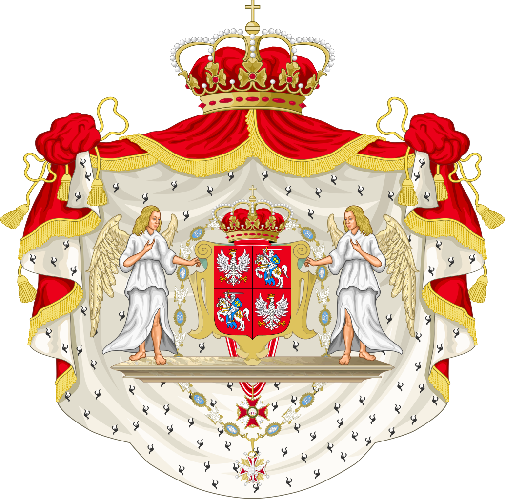
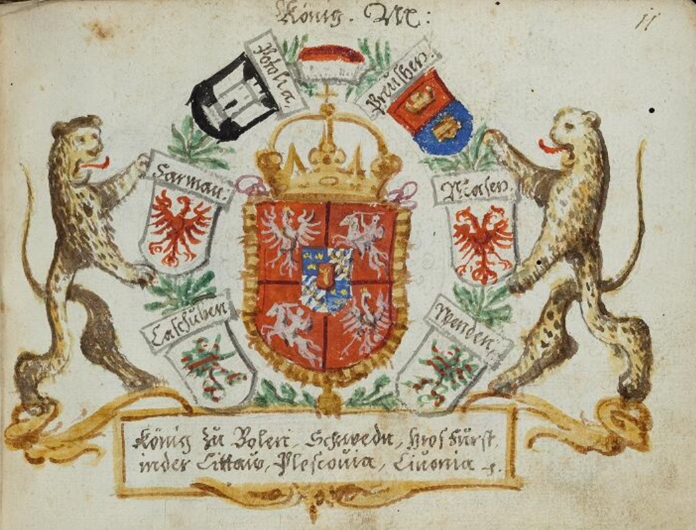

  

# **The Polish-Lithuanian Commonwealth**

The Polish-Lithuanian Commonwealth (1569–1795) was one of the largest and most politically unique states in European history. Formed by the Union of Lublin in 1569, it united the Kingdom of Poland and the Grand Duchy of Lithuania into a single political entity under a dual monarchy. The Commonwealth was a constitutional elective monarchy, characterized by its nobility-led government (szlachta), religious tolerance, and decentralized political system. At its height, it stretched from the Baltic Sea to the Black Sea and was a dominant force in European affairs. However, internal divisions, external invasions, and political stagnation led to its eventual partition and dissolution by 1795.

**Formation and Expansion (1569–1600s)**

- **Union of Lublin (1569):** Established the Polish-Lithuanian Commonwealth, merging Poland and Lithuania into a single state with a shared monarchy, parliament (Sejm), and foreign policy while maintaining separate armies and legal systems.
- **Golden Age:** Under kings like Stephen Báthory (r. 1576–1586) and Sigismund III Vasa (r. 1587–1632), the Commonwealth expanded its influence, defeating Russia, the Ottoman Empire, and Sweden in various conflicts.
- **Religious Tolerance:** The Commonwealth became a refuge for religious minorities, implementing the Warsaw Confederation (1573), which guaranteed freedom of worship—unprecedented in early modern Europe.

**Wars and Political Decline (1600s–1700s)**

- **Wars with Sweden and Russia (1600s):** The Deluge (1655–1660) saw Sweden and Russia invade the Commonwealth, causing massive devastation and weakening central authority.
- **Nobility and the Liberum Veto:** By the late 1600s, the Liberum Veto (unanimous voting requirement in the Sejm) crippled government efficiency, allowing foreign powers to manipulate Polish politics.
- **Great Northern War (1700–1721):** The Commonwealth became a battleground for Sweden and Russia, further destabilizing its political structure and economic stability.

**Partitions and Fall (1772–1795)**

- **First Partition (1772):** Russia, Prussia, and Austria seized large portions of Commonwealth territory, citing internal dysfunction.
- **Constitution of 3 May 1791:** A last-ditch reform attempt introduced Europe’s first modern constitution, but it was opposed by conservative nobles and foreign powers.
- **Second (1793) and Third Partitions (1795):** Russia, Prussia, and Austria completely dissolved the Commonwealth, erasing it from the map.
- **Legacy:** Despite its fall, the idea of Polish-Lithuanian unity inspired 19th-century independence movements, culminating in Poland and Lithuania regaining independence in 1918.

**Political-Military Cooperation**

The Polish-Lithuanian Commonwealth was a unique example of multinational military and political cooperation, balancing the interests of Poland, Lithuania, and various noble factions. Over its history, the Commonwealth developed distinct mechanisms for coordinating military strategy, defense, and foreign policy.

**1. The Sejm and Military Decision-Making**

- The Sejm (parliament) had significant authority over military matters, including taxation for war, troop levies, and foreign alliances.
- The Confederations (ad hoc political-military alliances of nobles) often played key roles in resolving military crises, including funding and commanding troops independently of the monarchy.

**2. Joint Military Campaigns and Defense Efforts**

- **Livonian War (1558–1583):**
   - The Commonwealth successfully defended Livonia (modern Latvia and Estonia) against Russian expansion under Ivan the Terrible, solidifying its influence in the Baltic.
   - Poland and Lithuania coordinated their forces, with Polish hussars and Lithuanian light cavalry forming the backbone of their military strategy.
- **Wars Against the Ottoman Empire (17th Century):**
   - The Battle of Khotyn (1621) saw joint Polish-Lithuanian forces, including the famous Winged Hussars, repel an Ottoman invasion.
   - In 1673, Polish King John III Sobieski led a multinational Commonwealth force to victory against the Ottomans at Khotyn.
- **Battle of Vienna (1683):**
   - A defining moment in European military history, where John III Sobieski led the largest cavalry charge in history, coordinating Polish and Lithuanian forces with Holy Roman Empire troops to defeat the Ottoman army besieging Vienna.
   - This victory was a high point of Commonwealth military diplomacy, securing Polish influence in Central Europe.

**3. Military Autonomy of the Grand Duchy of Lithuania**

- Lithuania maintained separate armies, which were integrated into Commonwealth-wide campaigns but could also operate independently when needed.
- Lithuanian forces played a decisive role in repelling Russian invasions during the Russo-Polish War (1654–1667)and Great Northern War (1700–1721).
- Lithuanian nobility often held joint command with Polish counterparts, ensuring a balanced representation in military leadership.

**4. Noble-Led Military Coalitions**

- The Confederation of Warsaw (1573) introduced noble-led military alliances to maintain stability.
- The Confederation of Bar (1768–1772) was a political-military movement opposing Russian influence and advocating for the restoration of Polish independence.
- The Kościuszko Uprising (1794), led by Tadeusz Kościuszko, was a last attempt at military resistance against partitioning powers (Russia, Prussia, Austria).

**Significance**

- **Political Innovation:** The Commonwealth’s elective monarchy and noble democracy were unique for their time.
- **Religious Tolerance:** One of the few early European states to formally protect religious minorities.
- **Cultural Flourishing:** Produced great literary, scientific, and artistic achievements, influencing later Polish and Lithuanian national identities.
- **Geopolitical Influence:** Played a major role in European power struggles, including wars against Sweden, Russia, and the Ottomans.

**Links**

1. [Union of Lublin and Formation of the Commonwealth](https://www.britannica.com/event/Union-of-Lublin)
2. [Wars and Conflicts of the Polish-Lithuanian Commonwealth](https://en.wikipedia.org/wiki/List_of_wars_involving_the_Polish–Lithuanian_Commonwealth)
3. [Final Partitions and Dissolution](https://www.britannica.com/event/Partitions-of-Poland)

