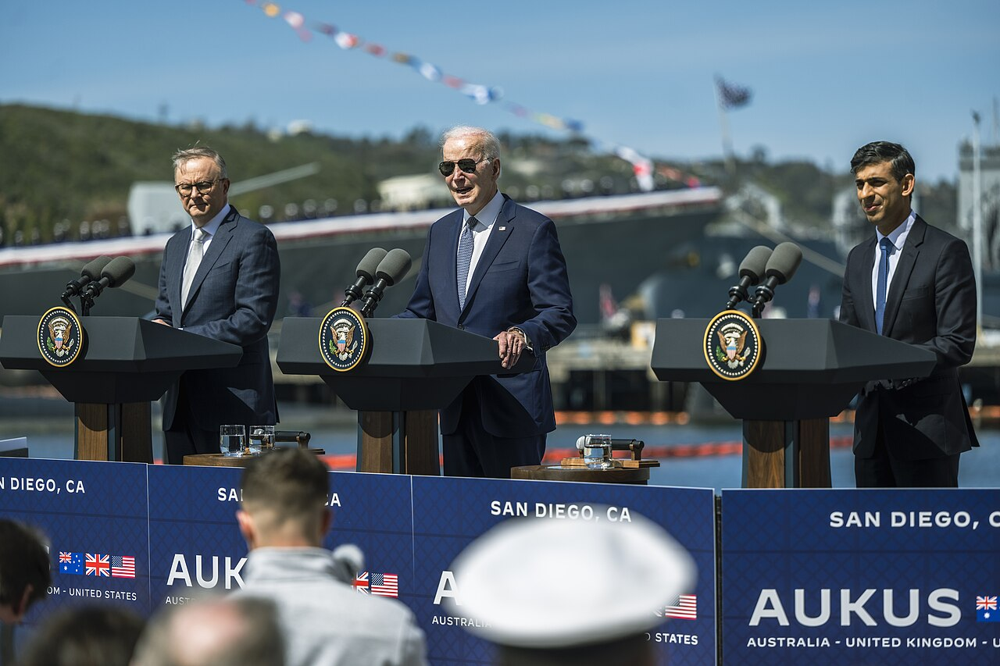
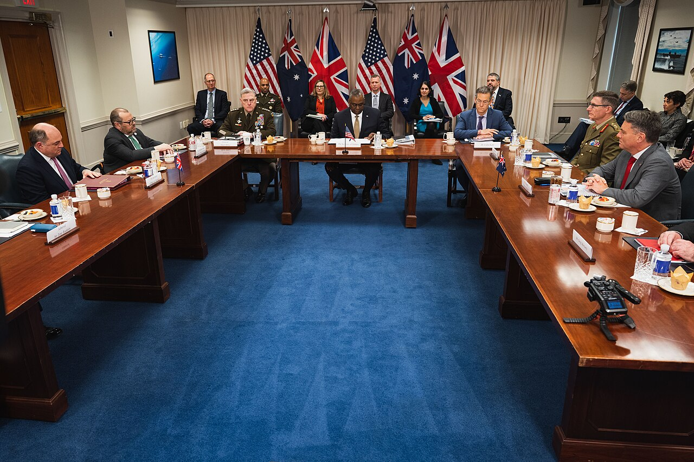

*President Joe Biden, British Prime Minister Rishi Surnak and Australian Prime Minister Anthony Albanese speak at the AUKUS bilateral meeting in San Diego, Calif, March 13, 2023. (DoD photo by Chad J. McNeeley)*
## Overview

AUKUS is a trilateral security partnership between [[Australia]], the [[United Kingdom]], and the [[United States]]. Announced in September 2021, the initiative aims to enhance military cooperation, deepen defense-industrial collaboration, and strengthen security in the Indo-Pacific region. The centerpiece of AUKUS is the commitment to assist Australia in acquiring nuclear-powered submarines, marking a major shift in regional power dynamics and long-term strategic deterrence. Beyond submarines, AUKUS also focuses on advanced military technologies, including cyber warfare, artificial intelligence (AI), quantum computing, and hypersonic weapons.

## History

- Formation (2021): AUKUS was unveiled as part of the three nations’ strategic efforts to counter growing security challenges in the Indo-Pacific, particularly China’s military expansion and aggressive maritime claims.
- Nuclear Submarine Agreement (2023–Present): Under Pillar I, the U.S. and UK agreed to help Australia acquire nuclear-powered attack submarines (SSNs) through technology sharing and industrial cooperation.
- Expansion into Emerging Technologies (2024-Present): AUKUS Pillar II was broadened to focus on advanced defense technologies such as AI, quantum computing, electronic warfare, and undersea capabilities.

## Characteristics & Initiatives
#### *Pillar I: Nuclear Submarines for Australia*
   - Australia will acquire at least three U.S.-built Virginia-class nuclear-powered submarines by the early 2030s.
   - The UK and Australia will co-develop the SSN-AUKUS, a new class of next-generation attack submarines, to be operational in the 2040s.
   - Establishes long-term U.S. and UK naval presence in Australia, boosting deterrence capabilities in the Indo-Pacific.
#### *Pillar II: Advanced Military Technology Cooperation*
   - Joint development in AI, cyber, quantum technologies, electronic warfare, and hypersonic weapons.
   - Collaboration in undersea capabilities to counter maritime threats.
   - Increased interoperability of military forces across AUKUS members.
#### *Geopolitical Impact:*
   - Strengthens U.S. and allied military presence in the Indo-Pacific.
   - Supports Australia’s strategic deterrence without requiring nuclear weapons.
   - Enhances UK’s role in Indo-Pacific security, aligning with its post-Brexit "Global Britain" strategy.
   - Intensifies China’s opposition, with Beijing condemning AUKUS as an effort to contain its influence.

*Secretary of Defense Lloyd J. Austin III hosts British Secretary of State for Defense Ben Wallace, and Australian Deputy Prime Minister and Minister of Defense Richard Marles during a trilateral defense ministerial meeting at the Pentagon, Washington, D.C., Dec. 7, 2022. (DoD photo by U.S. Navy Petty Officer 2nd Class Alexander Kubitza)*
## Resources

- [AUKUS Joint Leaders’ Statement (2021)](https://bidenwhitehouse.archives.gov/briefing-room/statements-releases/2023/03/13/joint-leaders-statement-on-aukus-2/#:~:text=When%20we%20announced%20the%20AUKUS,global%20nuclear%20non%2Dproliferation%20regime.)
- [Australia’s Nuclear Submarine Program](https://www.navy.gov.au/capabilities/ships-boats-and-submarines/nuclear-powered-submarines)
- [UK Ministry of Defence on AUKUS](https://www.gov.uk/government/news/aukus-statement-26-september-2024)