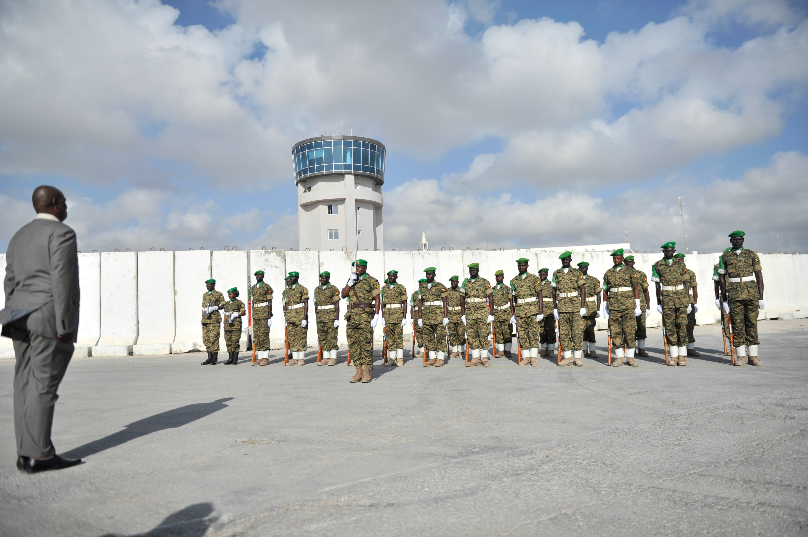

Title: ASF
Menu: No
Link: ASF

# **African Union Standby Force (ASF)**

The African Union Standby Force (ASF) was envisioned as Africa’s own rapid reaction force, capable of deploying to conflicts, coups, and peacekeeping missions without foreign intervention. While progress has been slow, ASF has taken part in missions in the Sahel, Somalia, and Central Africa, proving that African nations can and do take charge of their own security. As great-power competition intensifies in Africa, ASF’s development will determine how much the continent relies on Western, Russian, or Chinese military assistance.

**History:**

- Concept Development (2002): The ASF was conceived as part of the African Peace and Security Architecture (APSA), with the goal of providing a credible, African-led rapid response force.
- Regional Standby Brigades (2003–2010): The ASF was divided into five regional standby brigades—each managed by one of the African Regional Economic Communities (RECs).
- Operationalization (2015–Present): Initial capability was reached in 2016, with ongoing efforts to strengthen force readiness, logistics, and multinational command structures.

**Major Characteristics, Initiatives, and Important Facts:**

- *Five Regional Standby Brigades:* North African Standby Brigade (NASBRIG) East African Standby Force (EASF) Economic Community of West African States Standby Force (ECOWAS-SF) Central African Standby Force (FOMAC) Southern African Development Community Standby Force (SADC-SF)
- Peacekeeping and Crisis Response: ASF units are deployed to mediate conflicts, assist in humanitarian emergencies, and support post-conflict reconstruction.
- Interoperability and Training: ASF conducts joint exercises and multinational training operations to enhance force readiness and effectiveness.
- Support from International Partners: The AU receives technical and logistical assistance from the United Nations, European Union, and bilateral partners to strengthen ASF capabilities.
- Challenges and Future Development: Despite progress, the ASF faces funding, logistical, and political challenges in achieving full operational effectiveness for large-scale interventions.

**Links:**

- [African Union Official Website](https://au.int)
- [ASF Regional Standby Forces](https://www.accord.org.za/)
- [United Nations and ASF Cooperation](https://www.un.org/peacekeeping/en/african-union-partnership)