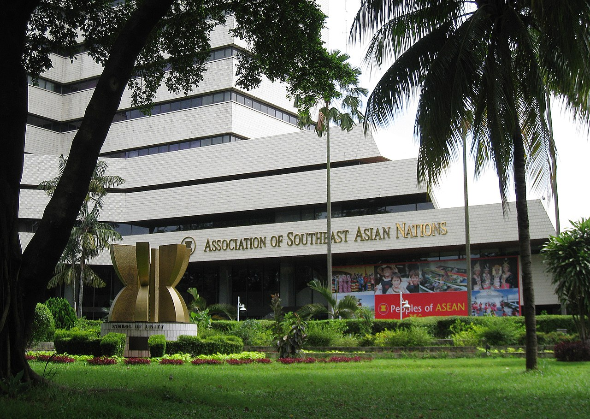

# **Association of Southeast Asian Nations (ASEAN)**

Unlike NATO, ASEAN lacks a collective defense clause, but its members—ranging from U.S.-allied Singapore to China-friendly Cambodia—have increasingly sought greater military cooperation amid regional tensions. 

ASEAN-led initiatives such as the ASEAN Defence Ministers' Meeting (ADMM) and joint naval drills reflect growing efforts to counter Chinese militarization in the South China Sea, piracy, and transnational terrorism. However, the bloc’s policy of non-interference and lack of a standing military force limit its ability to act decisively in crises.

**History**

- Formation (1967): ASEAN was established by Indonesia, Malaysia, the Philippines, Singapore, and Thailand to foster regional stability amid Cold War tensions.
- Expansion (1984–1999): ASEAN grew to include Brunei (1984), Vietnam (1995), Laos and Myanmar (1997), and Cambodia (1999), strengthening regional cooperation.
- Economic and Security Integration (2000s–Present): ASEAN launched initiatives like the ASEAN Economic Community (AEC) and expanded defense partnerships through ADMM-Plus with major powers such as the U.S., China, Japan, and India.

**Major Characteristics, Initiatives, and Important Facts**

- Member States: 🇧🇳 Brunei, 🇰🇭 Cambodia, 🇮🇩 Indonesia, 🇱🇦 Laos, 🇲🇾 Malaysia, 🇲🇲 Myanmar, 🇵🇭 Philippines, 🇸🇬 Singapore, 🇹🇭 Thailand, 🇻🇳 Vietnam.
- ASEAN Regional Forum (ARF): A platform for security dialogue, engaging partners like the U.S., China, Russia, and the EU.
- ASEAN Defence Ministers’ Meeting (ADMM-Plus): Enhances military interoperability and joint exercises with global partners.
- Economic Cooperation: The ASEAN Free Trade Area (AFTA) and partnerships like the Regional Comprehensive Economic Partnership (RCEP) make ASEAN a key global economic player.
- South China Sea Disputes: ASEAN has struggled to form a unified response to China’s maritime claims, balancing diplomacy with member states' national interests.
- Counterterrorism and Maritime Security: Works on anti-piracy operations, intelligence-sharing, and cybersecurity with global allies.
- "ASEAN Way" Diplomacy: Prioritizes non-interference, consensus-building, and peaceful negotiation over forceful intervention in regional conflicts.

**Links**

- [ASEAN Official Website](https://asean.org/)
- [ASEAN Defence Ministers’ Meeting (ADMM)](https://admm.asean.org)
- [ASEAN Economic Cooperation](https://asean.org/our-communities/economic-community/integration-with-global-economy/asean-eas-economic-cooperation/)